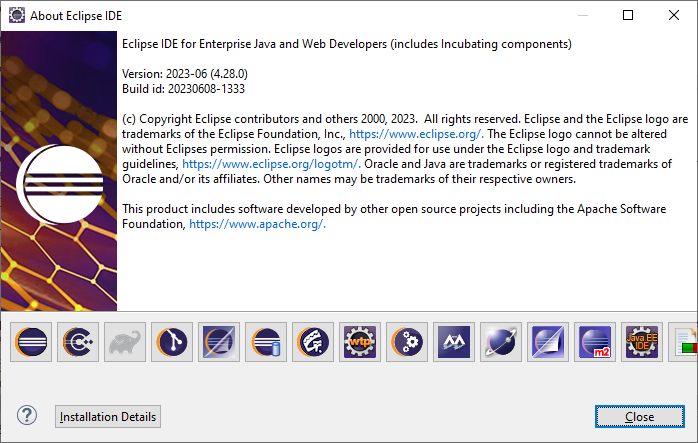
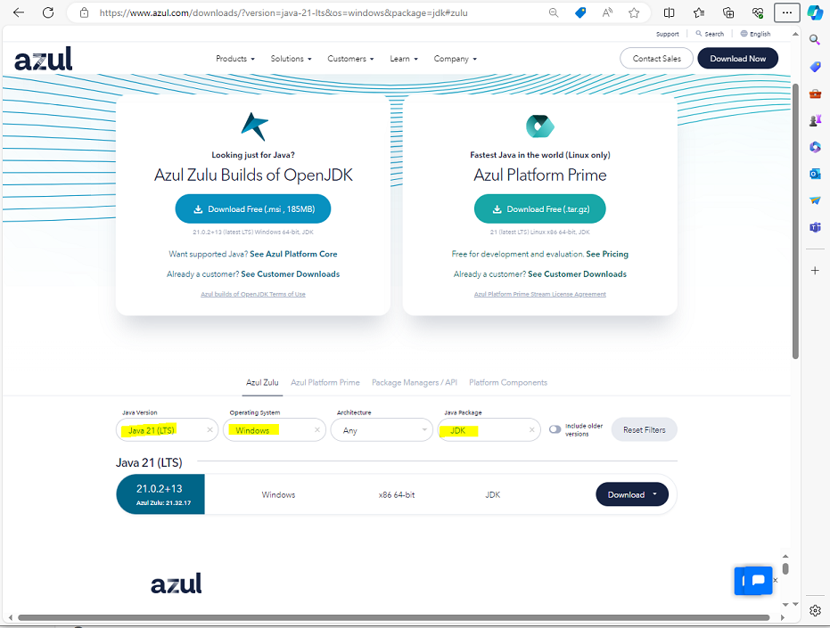
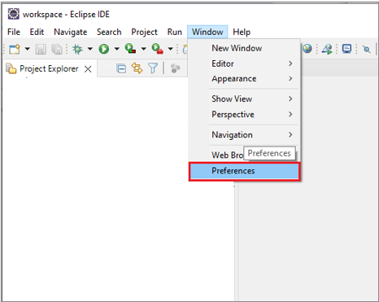
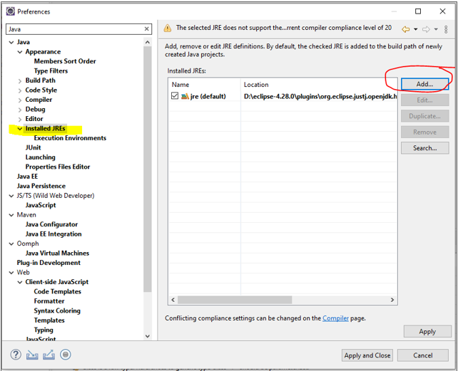
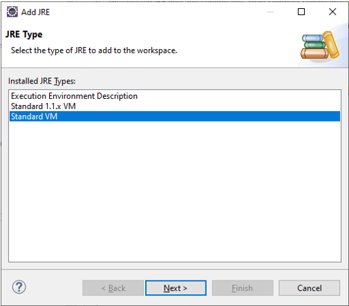
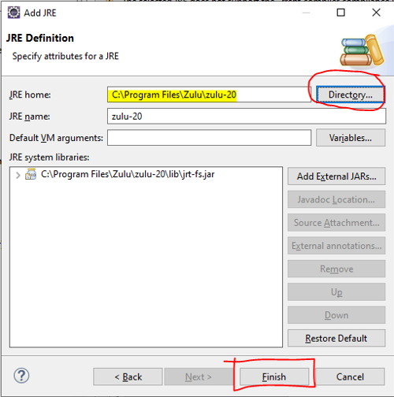
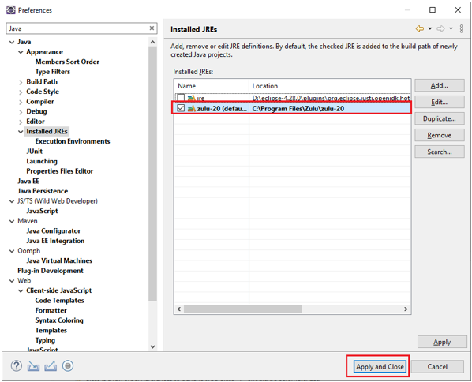

# Development Environment Setup
If you are interested in contributing as a developer to the **CIMTool** project, the following instructions will assist you in the setup of a development environment for the **CIMTool 2.x.x** release line.  Active development on the **CIMTool 1.x.x** release line has ceased but instructions for developent environment setup for the older release line can be located [here](dev-env-setup-cimtool-1.x.x.md)

## Part 1:  Eclipse Installation
The following steps describe how to locate, install and setup the appropriate Eclipse Integrated Development Environment (IDE).

> To eliminate unanticipated configuration and/or setup issues these instructions recommend a specific edition/release of the Eclipse Integrated Development Environment (IDE) for development in the **CIMTool 2.x.x** release line. Develoment and deployment of **CIMTool** with this release has been fully tested and ncecessary  plugin dependencies verified out-of-the-box. Please post any questions to the [CIMTool 2.x.x Release Line - Development Community Discussion Board](https://github.com/cimug-org/CIMTool/discussions/92)

### Step 1: Download "Eclipse IDE for Enterprise Java and Web Developers"
Specifically, the "Eclipse IDE for Enterprise Java and Web Developers" release of the [Eclipse IDE 2023-06 R Packages](https://www.eclipse.org/downloads/packages/release/2023-06/r) is recommended with the Windows 64-bit version available [here](https://www.eclipse.org/downloads/download.php?file=/technology/epp/downloads/release/2023-06/R/eclipse-jee-2023-06-R-win32-x86_64.zip). Note that versions for Mac and Linux are also available at this site but these instructions are specific to Windows.




### Step 2: Install Java
If you do not already have a newer version of Java (>= Java 20) installed on your system it should be downloaded and installed before moving on to the next step. [Azul](https://www.azul.com) has a great freely available Windows 64-bit option available at the [Azul Zulu OpenJDK Downloads](https://www.azul.com/downloads/?package=jdk#zulu) site. Installation is straightforward if using the ```.msi``` installer and installation instructions are available on Azul's site of needed.



### Step 3: Extract Eclipse IDE
The installation process for the Eclipse IDE is straightforward in that it involves simply extracting the [eclipse-jee-2023-06-R-win32-x86_64.zip](https://www.eclipse.org/downloads/download.php?file=/technology/epp/downloads/release/2023-06/R/eclipse-jee-2023-06-R-win32-x86_64.zip) archive downloaded in Step 1.  It should be noted that depending on where you choose to extract the archive on Windows, the process may fail due to path names being too long. If this occurs it is suggested you create a temp directory off of the root of one of your local drives (e.g. `C:\temp-eclipse`) and extract the ZIP archive into that folder. The shorter base path should prevent "path too long" errors while extracting the archive. A folder called `\eclipse` will be created under the selected extract directory and will contain your eclipse environment. Feel free to relocate this new folder to a location on the file system where you prefer to host your Eclipse IDE.

### Step 4: Set New Installed JRE within the Eclipse IDE
If you downloaded and installed a newer version of Java in the previous Step 2 then you will need to add it to your new Eclipse IDE configuration before importing the **CIMTool** projects into your environment. 












## Part 2:  Clone and Import of the CIMTool Project  

The final step needed to complete the setup of the CIMTool Eclipse IDE is to clone an appropriate development branch of the CIMTool codebase from the [CIMTool GitHub Repo](https://github.com/cimug-org/CIMTool). Your options include:

- Use external GitHub tools such as [GitHub Desktop](https://desktop.github.com/), [TortoiseGit](https://tortoisegit.org/), [GIT for Windows](https://gitforwindows.org/), etc. (for a comprehensive list visit [here](https://git-scm.com/downloads/guis)). When using an external Git client you will perform a clone to a local directory on your file system and then import the projects from the directory into Eclipse.

- Use Eclipse's pre-bundled **Git** plugin to clone and import the **CIMTool** projects directly from the [CIMTool GitHub Repo](https://github.com/cimug-org/CIMTool).  The plugin can be configured from within the preferences dialog im **CIMTool**.
