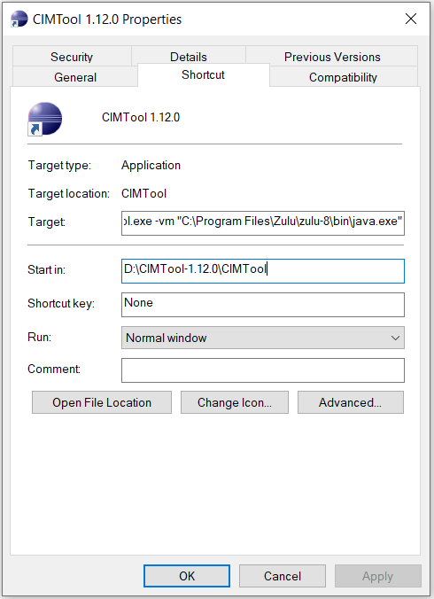
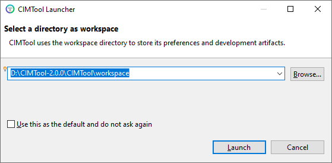
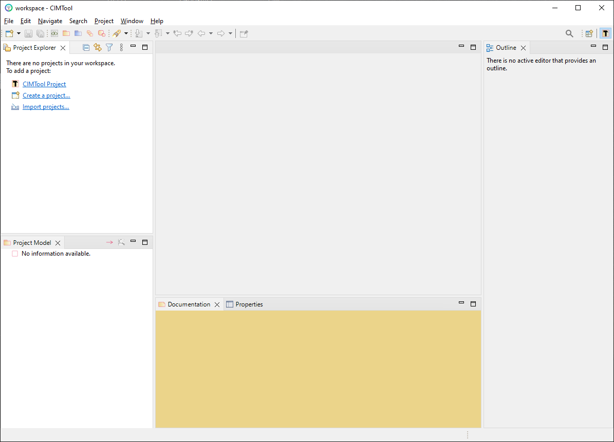

# Getting Started
**CIMTool** is an [Eclipse](https://www.eclipse.org/) plugin written in Java so you can run **CIMTool** on Windows, Linux or Mac OS. However, *only the Windows binary is built and published by maintainers*, for other platforms you must compile from Java source. You'll need at least 2GB of free disk space (more if you will be working with large Contextual Profiles).

## Step 1 - Download CIMTool
Download the latest binary release of **CIMTool** [here](https://github.com/cimug-org/CIMTool/releases) and extract. The **CIMTool** binary release is delivered as a ZIP archive (e.g. `CIMTool-x.x.x-win32.win32.x86_64.zip`) and once downloaded should be extracted to a folder on your machine. 

!!! example

    Extracting to `D:\CIMTool-2.0.0` folder on a Windows system would result in a new  `D:\CIMTool-2.0.0\CIMTool` folder containing **CIMTool** and it dependencies.  The launchable executable would be located at `D:\CIMTool-2.0.0\CIMTool\CIMTool.exe`

## Step 2 - Install Java
Starting with **CIMTool** release 2.0.0 and later you no longer need to download and install a Java runtime environment. Instead, the appropriate release of Java now comes bundled in the ZIP archive. All that is needed is to extract the ZIP file and then launch the CIMTool executable (i.e. `CIMTool.exe`). This greatly simplifies the installation process and if installing such a release you may skip over this step and proceed on to Step 3 below.

If installing a release prior to 2.0.0, in order to successfully run **CIMTool**, a 64-bit Java 8 JRE/JDK must be installed. New supported releases of Java 8 are currently available at either of the below locations. Note that you should review the relevant licensing requirements for these downloads. Oracle may be more restrictive than for your purposes in which case the Zulu OpenJDK release may be preferable:

 - [Oracle JDK](https://www.java.com/en/download/)
 - [Zulu OpenJDK](https://www.azul.com/downloads/?package=jdk#download-openjdk)

Once installed on your system you can execute `java -version` from a command prompt to determine what the default JRE/JDK is on your system:

!!! example

    

    In this example, we see from the results that on this system the default JRE/JDK is a version of Java 8 (i.e. version 332). There may be other versions of Java installed on the system but we know from the output that it will be the Java 8 installation that will be used to execute **CIMTool** by default if we double click the installed executable located at `D:\CIMTool-1.11.1\CIMTool\CIMTool.exe` in our example.

### Setting up Alternate JVM
If the command line results indicate a different default Java version, then either a Windows shortcut or .bat script can be created so that an alternate (non-default) JVM can be used for launching **CIMTool**. These options can be configured in the following manner.

#### Option 1 - Windows Shortcut
Locate the directory containing the Java 8 JRE/JDK release you installed on your system (a 64-bit installation of Zulu for example will typically be located in either `C:\Program Files\Zulu\zulu-8-jre\bin\java.exe` or `C:\Program Files\Zulu\zulu-8\bin\java.exe` depending on whether you've downloaded a JRE or JDK release).

In Windows right-click on the **CIMTool.exe** and select the menu option for creating a shortcut. Right-click on the new shortcut and select the Properties menu option. In the dialog that comes up explicitly specify as a command line parameter a 64-bit JVM to use at launch time.  This change must be specified in the "Target:" field.  In this working example, the resulting entry in that field would be:  `D:\CIMTool-1.11.1\CIMTool.exe -vm "C:\Program Files\Zulu\zulu-8\bin\java.exe"`



#### Option 2 - Batch Script
An alternative approach is to create a `CIMTool.bat` script containing command line execution similar to that shown below but which correlates to the installation locations native to your own local file system:

```bat
rem Launch CIMTool using a 64-bit Java JRE 8
C:\CIMTool-1.11.1\CIMTool\CIMTool.exe -vm "C:\Program Files\Zulu\zulu-8\bin\java.exe"
```

!!! bug

    An [issue](https://github.com/cimug-org/CIMTool/issues/14) was reported whereby CIMTool-1.10.0.RC1 and earlier releases no longer launch cleanly using newer releases of Java 8. The fix for this was introduced in the CIMTool-1.10.0.RC2 release.  Note that for users with older versions of **CIMTool** (e.g. 1.10.0.RC1, 1.9.7, or earlier) on their system those instances will no longer work if the Java 8 installation is upgraded to a newer release. To have co-existing instances of both old and new releases of **CIMTool** you will need to have both a new and older release of the Java 8 JRE/JDKs installed (in two distinct locations) and, in turn, distinct shortcuts and/or .bat files in order to specify the appropriate Java 8 JVM to use when launching **CIMTool**.

## Step 3 - Launch CIMTool
Upon a successful launch of **CIMTool** the following dialog is presented. A default workspace (as shown by the example in the screenshot) will be used or you can enter your own location and name for a workspace to be created.



Select the **OK** button, and the workbench view will appear



!!! tip

    It recommended to not add, modify or delete anything inside a workspace directory manually or with tools other than **CIMTool** to prevent corrupting your project. However, if you ever see a message indicating 'resource out of sync', you can usually correct it by using File -> Refresh or pressing F5.