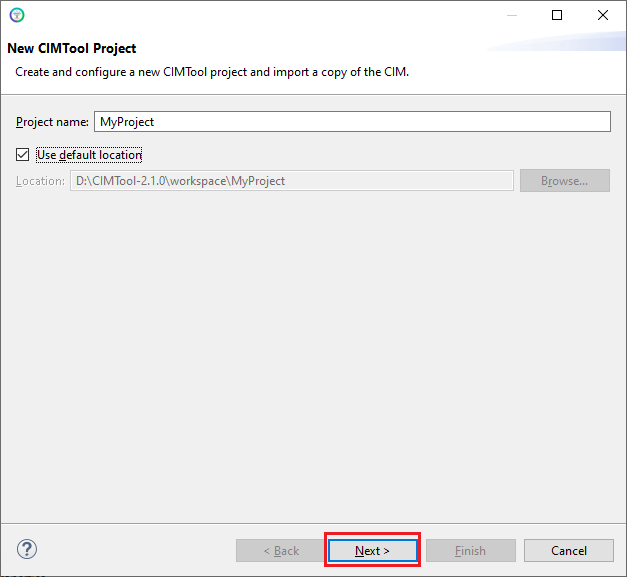
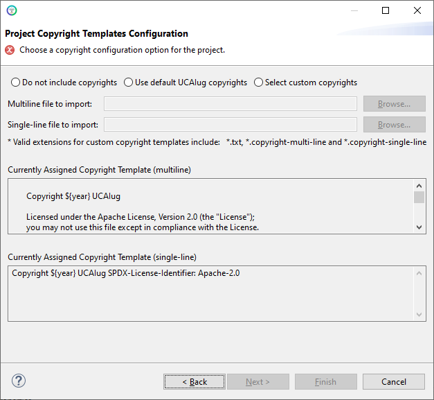
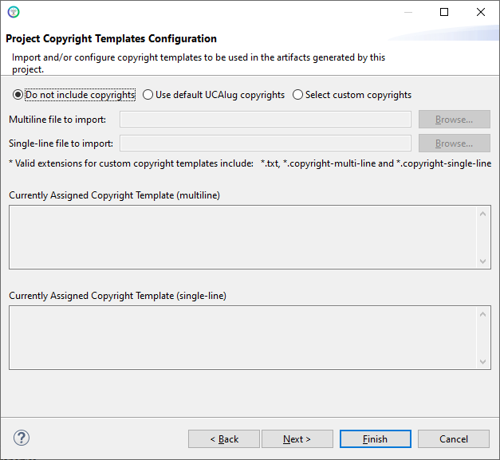
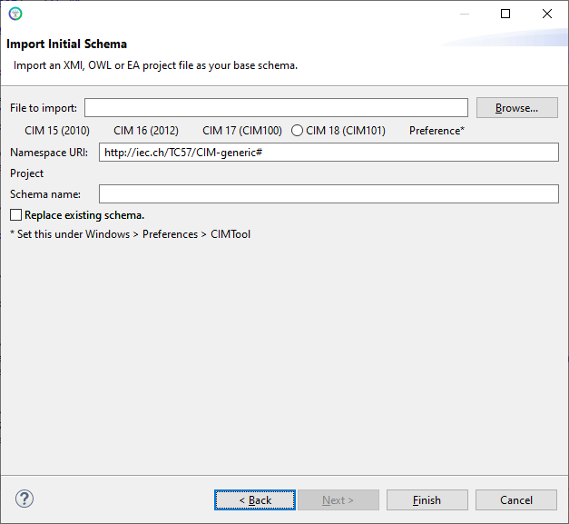
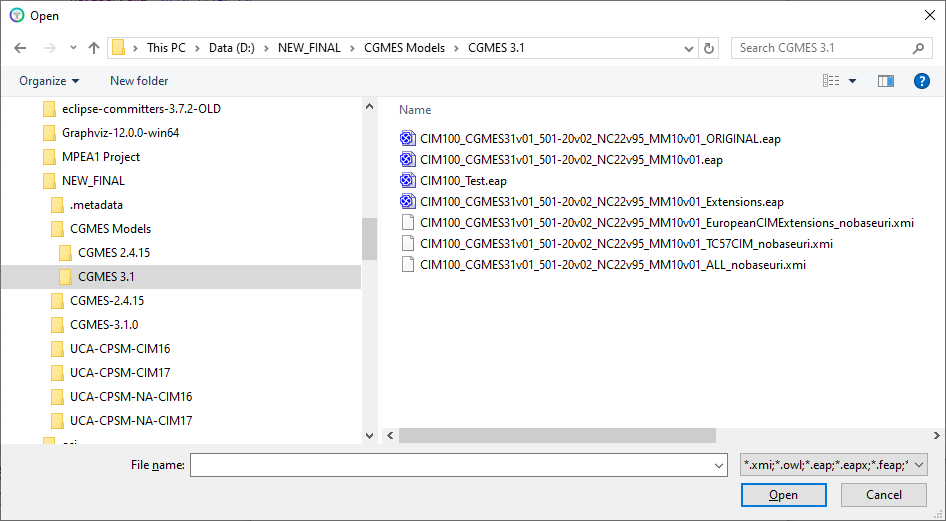
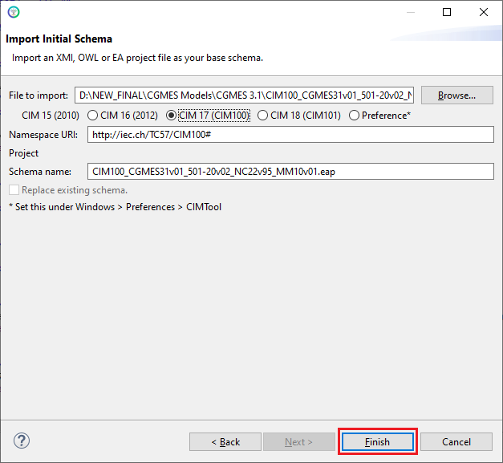

# Create a Project
To create a new project. Select File -> New -> CIMTool Project.

In the dialog box that appears, give it a name (e.g. 'MyProject') then click 'Next'. 

In the next dialog box that appears. select whether or not you want to include copyrights within your auto-generated artifacts (e.g. XSD, RDFS, etc.). Here you can load your own custom copyright headers or use the default UCAIug Apache 2.0 copyright headers provided by CIMTool. 

If you do not require copyrights you can simply select 'Do not include copyrights'and click 'Next' or 'Finish' depending on if you will be specifying a CIM schema for your project at this time or not. It is suggested, but not required, to add your schema while creating your project by clicking 'Next'.

Note:  it is possible to add copyrights later to your project via 'File -> Import...'

Next in the Create New Project wizard you will be asked to specify an initial base schema. Click 'Browse...'.

Select the source file you want to use as your schema.  This could be an `.xmi` file or a Sparx EA 15.x `.eap` or 16.x `.qea` project file for example. 

Last you must declare the namespace URI to be associated with the CIM schema you chose in the previous step. At this point you can select one of the radio buttons to specify a predefined namespace or select the 'Preference' radio button to enter your own. Click the 'Finish' button. A new project folder is created in your CIMTool workspace.

