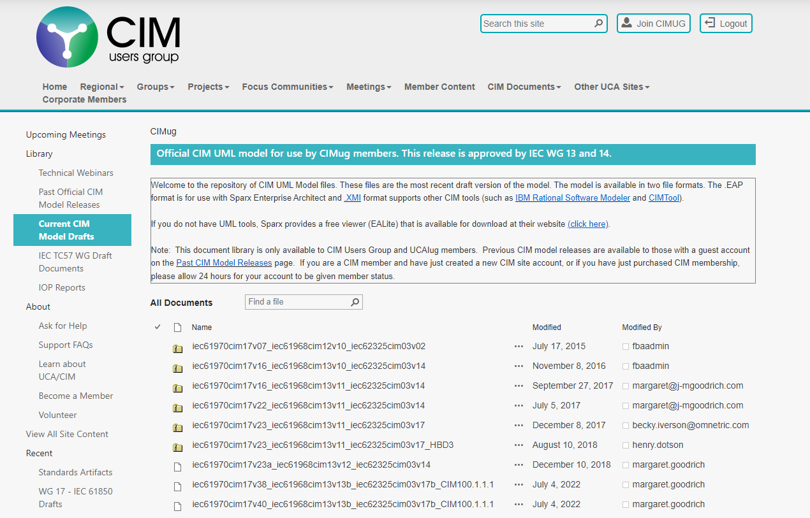
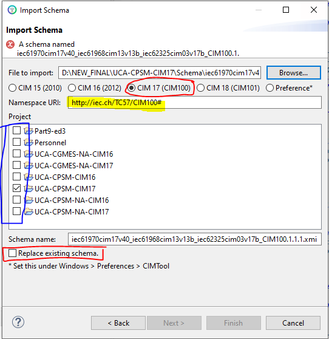

# Import a Schema (e.g. CIM UML)
Before building a Contextual Profile in **CIMTool** you first need to import a version of the CIM UML. The CIM UML is typically imported when creating a new **CIMTool** project. However, you can also add custom UML to supplement an existing CIM UML schema or do a full replace of the CIM UML, as in the case of a new CIM version.

## Obtain the CIM UML
UCAIug Task Force 13 (UTF13), UCAIug Task Force 14 (UTF14), and UCAIug Task Force 16 (UTF16) are groups that work to advance the CIM and who publish periodic releases of the CIM UML. These releases are published to the [CIM Users Group](https://cimug.ucaiug.org/) website in [Enterprise Architect](https://sparxsystems.com/) Project file (`.eap` or `.eapx`) format.

You can download the current version of CIM UML Enterprise Architect (`.eap`/`.eapx`) files from CIM Users Group website [here](https://cimug.ucaiug.org/CIM%20Model%20Releases/Forms/AllItems.aspx). The page looks like this:

!!! note

    You must have a CIM Users Group account to access to previous versions of the CIM UML. Use the CIM Users Group [Join form](https://cimug.ucaiug.org/pages/Join.aspx) to get an account. Note that there both paid and free levels. The free account does give access to previous versions of the CIM UML.

## Import via `.xmi`
Unfortunately, Enterprise Architect Project files (`.eap`) can't be easily imported directly into **CIMTool**. To use them in **CIMTool**, most users will find it is easiest to convert from an `.eap` or `.eapx` file to an XML Metadata Interchange (XMI) file (`.xmi`).

Enterprise Architect has an "Export" feature to export to `.xmi` format. To use this, open the desired CIM UML version of the `.eap` or `.eapx` file (e.g. `iec61970cim17v38_iec61968cim13v13_iec62325cim03v17a.eap`) in Enterprise Architect. Then select the top level package.

!!! note

    Note that you can't export to `.xmi` with Enterprise Architect Lite version, only with the full (paid) version of Enterprise Architect.

In the top ribbon, select the Publish tab, then click Export-XML

Use the following export options

  * Select XMI 1.1
  * Select a Filename (save location and name) for the XMI file. Using a name that matches the `.eap` is helpful (e.g. `iec61970cim17v38_iec61968cim13v13_iec62325cim03v17a.xmi`)

Then click the Export button

To import the `.xmi` file, in **CIMTool** open the projects you'd like to add the CIM UML to and Select File -> Import. In the Import dialog, expand CIMTool folder and select Import Schema.

Browse to find the XMI file you exported from Enterprise Architect previously then select the checkboxes next to the project(s) for which you'd like to import the UML. Don’t edit the Namespace.

Once imported the CIM UML will be stored in the **Schema** folder of the project.

There is typically one schema per project, although there are cases where there may be more than one (e.g. if you have custom extensions or multiple CIM UML versions for a single Contextual Profile).

## Using the `.eap` File Directly
An alternative to exporting from Enterprise Architect as an XMI file is to directly import the Enterprise Architect Project (`.eap`) file into **CIMTool**. This eliminates the need to export anything from Enterprise Architect before importing to **CIMTool**. 

If you have hard requirement to support unicode in your UML model and are using an .eap project file rather than an .eapx file refer to the [README](https://github.com/CIMug-org/CIMTool) page for further information and links to the EA Sparx documentation on converting your project file to support unicode. Note that this is not necessary in most scenarios when utilizing a CIM EA project file.
