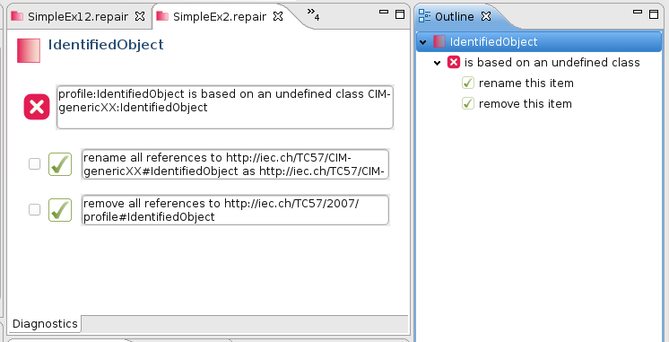

# Profile Maintenance
A profile can lose synchronism with the CIM. Each profile applies to a specific version of the CIM, but the life cycle of each profile and the CIM are independent of each other.

For example, a change in the CIM might leave a profile with a reference to a non-existent class. More subtle mismatches are also possible. An attribute could be replaced with an association, or the cardinality of an association changed leaving the profile inconsistent with with respect to the CIM.

CIMTool provides several features that help you to maintain a profile in the face of changes in the CIM.

You can compare two versions of the CIM and view the differences.
You can compare two profiles and view their differences.
You can analyse a profile against a specific version of the CIM and find inconsistencies.
You can view suggested corrections and apply them to the profile.

See [Comparing Profiles and Schemas](comparing-profiles-schemas.md) for details of the comparison functions.

## Automatic Profile Analysis
Profile analysis and correction is performed by a combination of the build system and the Repair Editor.

Profile analysis is automatically performed by the eclipse build system each time a changed profile is saved or a new schema is imported. (You should ensure that automatic builds are switched on under the Project menu.)
If inconsistencies are found, a .repair file is created in the project with the same name as the profile. The repair file is seen in the Project Explorer View with a red icon. In addition, a problem marker is attached to the profile.

## Profile Repair Editor
Open the repair file in the Repair Editor (which is the default for this file type). From the Project Explorer View double click the file.
The outline view shows each element in the profile that has inconsistencies. The problems and the suggested corrections are grouped under each element.
Selecting an item in the outline causes the main window of the repair editor to show its full details.

  * To effect a correction, check the displayed suggestion. Once all desired corrections have been checked, click the save button.
  * When the repair editor is saved, the checked corrections are applied to the profile and it is re-analysed. If all inconsistencies have been resolved by the corrections, the repair file and the problem marker are removed.
  * Otherwise the repair file is updated to show remaining problems and any new problems revealed after the corrections were applied.

## Namespace Mismatches
Namespace mismatches between the profile and the schema are the most common source of inconsistencies. It can be tedious to correct these, even using the repair editor.

For that reason a separate wizard, Reorganise and Repair wizard is provided for performing bulk updates to a profile. This is accessed from the Summary Page in the Profile Editor.
