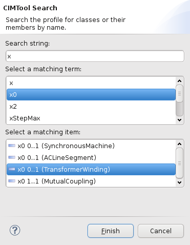
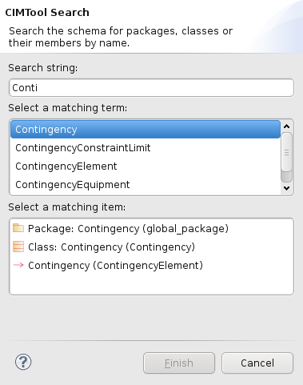
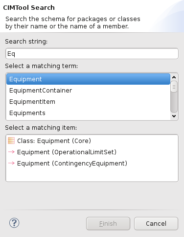

# Searching Schemas and Profiles
Often, the best way to find a definition in the CIM UML or a Contextual Profile is to use **CIMTool**'s search wizard. The search button looks like this  for schema or this  for profiles and appears above the view. Click one of these to display the search wizard.

The search wizard accepts a string and displays matches. Here is an example where we search for zero-sequence reactance properties:

To begin, enter the first few letters of the search term in the top box. If several terms match this prefix you select one in the second box. The third box then shows all classes and properties from the profile with this name.

In the example above four x0 properties are found and each is displayed with the name of its class.

To jump to the definition, select the class or profile and click the Finish button. This will focus the profile editor and profile outline on the chosen definition. The Project Model View and Documentation View will also update to show the corresponding schema (i.e. CIM) definition.

## Search the CIM UML
To search the schema (i.e. the CIM UML) use the search button on the Project Model View. Switching to the CIMTool Browsing perspective may also be helpful.

The scope of a schema search includes packages, datatypes and enumeration values as well as classes and properties. For example, Contingency is the name of a package, a class and a property in the CIM as seen here:

In this example, the terms in brackets next to each match are the containing package for the first two hits and the containing class for the last hit (the property).

The effect of clicking the Finish button is to highlight the result in the Profile Model View and the Documentation View.

## Adding Search Results to a Profile
Schema search is also available within the profile editor to assist in adding classes to the profile. The search button appears on the Add/Remove page when the profile element (top item) in the outline is selected.

The effect of clicking Finish is to highlight the selected class or package so it can be immediately added to the profile. If a property is selected, then its containing class is highlighted for addition.

The result is also highlighted in the Profile Model View and the Documentation View.

!!! warning

    Occasionally, the search wizard will find a term or an item that can't be shown in the associated view or editor. In its default mode, the Add/Remove page does not show schema classes if they have already been added to the profile. Searching for one of these will result in its containing package being highlighted.