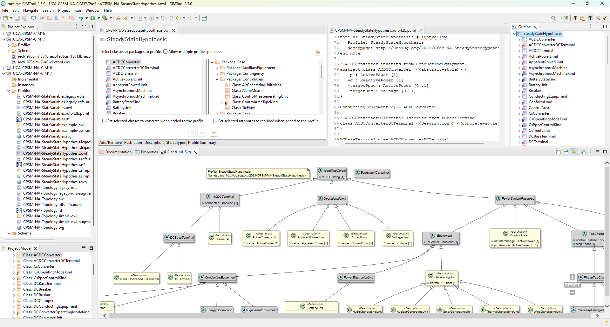

# Welcome
[**CIMTool**](https://github.com/CIMug-org/CIMTool) is an open source tool for working with the [Common Information Model (CIM)](https://www.iec.ch/dyn/www/f?p=103:7:0::::FSP_ORG_ID,FSP_LANG_ID:1273,25) to produce design artifacts such as database schemas, message exchange syntax, source code classes, and reference documentation. CIM is a UML model used in the electric power generation, transmission, and distribution domains.

## Overview
**CIMTool** allows users to:

  * Create Contextual Profiles from the CIM Unified Model Language (UML)
  * Generate schemas such as [Resource Description Framework Schema (RDF Schema)](https://www.w3.org/2001/sw/wiki/RDF) from a Contextual Profile
  * Create their own custom builders and import them into CIMTool to generate alternate types of target output (e.g. Word docs, SQL DB scripts, Apache Avro schemas, source code such as Java, C#, Python, etc).  See the [CIMTool Builders Library Project](https://cimtool-builders.ucaiug.io/) for detailed instructions on how to create your own builder.
  * Validate Contextual Profile schemas
  * Validate data instances against a Contextual Profile schema
  * Validate incremental data instances against an instance and a Contextual Profile schema
  * Import Contextual Profiles from a spreadsheet

## Questions and Discussion
The **CIMTool** community has a [Discussion board on GitHub](https://github.com/CIMug-org/CIMTool/discussions) which you can use to ask questions, get help, and engage with the rest of the community.
